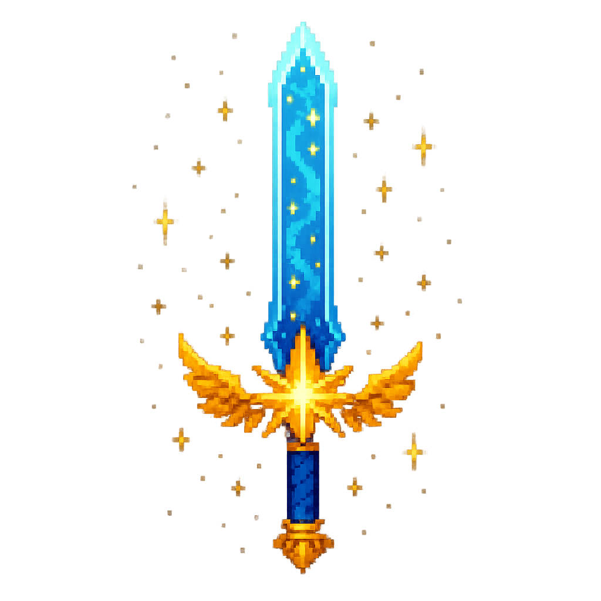

# ⚔️ AI Loot Generator

<div align="center">



_An AI-powered loot generator that creates epic fantasy items using Ollama language models_

[](https://nodejs.org/)
[](https://www.typescriptlang.org/)
[](https://opensource.org/licenses/MIT)
[](./tests)

</div>

## ✨ Features

🎲 **Six Legendary Tiers** - From humble Bronze to reality-bending Celestial  
🤖 **AI-Powered Creativity** - Harness Ollama models for unique item generation  
🗄️ **Smart Persistence** - SQLite database with intelligent duplicate detection  
🎮 **Rich Item Types** - Weapons, armor, accessories, consumables, and more  
⚡ **Beautiful CLI** - Elegant terminal interface built with Ink React  
🔗 **Loot Set System** - Generate connected items with shared themes and lore  
📊 **Comprehensive Stats** - Track your legendary collection

## 🚀 Quick Start

### Prerequisites

1. **Node.js 16+** - [Download here](https://nodejs.org/)
2. **Ollama** - AI model runtime

```bash
# Install Ollama (macOS)
brew install ollama

# Or install via curl (Linux/macOS)
curl -fsSL https://ollama.com/install.sh | sh

# Start Ollama service
ollama serve

# Pull your favorite model
ollama pull llama3.1
```

### Installation

```bash
# Clone the legendary repository
git clone https://github.com/kacesensitive/ai-loot.git
cd ai-loot

# Install dependencies
yarn install
# or npm install

# Build the magic
yarn build

# Install globally for system-wide access
npm link
```

## 🎮 Usage

### Generate Epic Loot

```bash
# Generate a random item
ai-loot generate

# Forge 5 Legendary weapons
ai-loot generate --tier Legendary --count 5 --type Weapon

# Create a complete armor set
ai-loot generate --tier Platinum --set "Dragon Guardian" --type Armor --count 4

# Use a specific AI model
ai-loot generate --tier Celestial --model codellama --count 1
```

### Explore Your Collection

```bash
# Browse recent discoveries
ai-loot list

# Filter by tier
ai-loot list --tier Celestial --limit 5

# Search by set name
ai-loot list --set "Dragon Guardian"
```

### View Statistics

```bash
# Display collection analytics
ai-loot stats
```

### Manage AI Models

```bash
# List available Ollama models
ai-loot models
```

## ⚔️ Loot Tiers

Each tier represents a different level of power and rarity:

<table>
<tr>
<th>Tier</th>
<th>Multiplier</th>
<th>Rarity</th>
<th>Description</th>
<th>Example</th>
</tr>
<tr>
<td><strong>🥉 Bronze</strong></td>
<td>1.0x</td>
<td>5-25%</td>
<td>Common starter gear</td>
<td>Iron Sword, Leather Boots</td>
</tr>
<tr>
<td><strong>🥈 Silver</strong></td>
<td>1.5x</td>
<td>20-40%</td>
<td>Uncommon with minor enchantments</td>
<td>Silver Bow, Mage Robes</td>
</tr>
<tr>
<td><strong>🥇 Gold</strong></td>
<td>2.0x</td>
<td>35-60%</td>
<td>Rare items with unique properties</td>
<td>Flaming Blade, Crystal Shield</td>
</tr>
<tr>
<td><strong>💎 Platinum</strong></td>
<td>3.0x</td>
<td>55-75%</td>
<td>Very rare with powerful abilities</td>
<td>Storm Caller, Void Armor</td>
</tr>
<tr>
<td><strong>⭐ Legendary</strong></td>
<td>5.0x</td>
<td>70-90%</td>
<td>Legendary artifacts of great power</td>
<td>Excalibur, Crown of Kings</td>
</tr>
<tr>
<td><strong>🌟 Celestial</strong></td>
<td>10.0x</td>
<td>85-100%</td>
<td>Divine relics that bend reality</td>
<td>God Slayer, Time Weaver</td>
</tr>
</table>

## 🛡️ Item Types

<details>
<summary><strong>⚔️ Weapons</strong> - Tools of destruction</summary>

- **Swords** - From daggers to greatswords
- **Bows** - Ranged precision weapons
- **Staves** - Magical implements
- **Axes** - Brutal cleaving weapons
- **Spears** - Piercing polearms
- **Maces** - Crushing implements

</details>

<details>
<summary><strong>🛡️ Armor</strong> - Protection and defense</summary>

- **Helmets** - Head protection
- **Chestplates** - Torso armor
- **Leggings** - Leg protection
- **Boots** - Foot protection
- **Gauntlets** - Hand armor
- **Shields** - Defensive implements

</details>

<details>
<summary><strong>💍 Accessories</strong> - Magical enhancements</summary>

- **Rings** - Finger-worn enchantments
- **Amulets** - Neck-worn talismans
- **Cloaks** - Protective garments
- **Belts** - Utility accessories

</details>

<details>
<summary><strong>🧪 Consumables</strong> - Temporary powers</summary>

- **Potions** - Magical elixirs
- **Scrolls** - Spell containers
- **Food** - Sustenance items
- **Bombs** - Explosive devices

</details>

<details>
<summary><strong>💎 Materials</strong> - Crafting components</summary>

- **Metals** - Raw materials
- **Gems** - Precious stones
- **Fabrics** - Cloth materials
- **Wood** - Natural materials

</details>

<details>
<summary><strong>🔮 Special Types</strong></summary>

- **Runes** - Enchantment stones
- **Artifacts** - Unique legendary items

</details>

## 🛠️ Development

```bash
# Run in development mode
yarn dev

# Run tests
yarn test

# Run tests in watch mode
yarn test:watch

# Generate coverage report
yarn test:coverage

# Type checking
yarn type-check

# Build for production
yarn build
```

## 📊 Example Output

```
🌟 Generated Celestial Loot
━━━━━━━━━━━━━━━━━━━━━━━━━━━━━━━━━━━━━━━━━━━━━━━━━━━━━━━━━

⭐ Voidcutter, Blade of Infinite Sorrow
   Weapon • Celestial Tier • Rarity: 97%

   A sword forged from crystallized despair and starlight, its edge
   exists in multiple dimensions simultaneously. Reality warps around
   its presence, and enemies question their existence upon seeing it.

   ⚔️  Damage: 142        🎯 Critical Chance: 38%
   ⚡ Attack Speed: 85    💥 Critical Damage: 445%
   📏 Range: 12.5m        🎲 Accuracy: +35
   🛡️  Durability: 589    ⚖️  Weight: 0.3kg
   💰 Value: 4,750 gold

   ✨ Magical Properties:
   • Dimensional Rift: Attacks ignore armor and shields
   • Soul Harvest: Each kill restores 25% health and mana
   • Reality Tear: 15% chance to banish enemies to the void

   📖 "Legend speaks of a blade that cuts not flesh, but the very
   fabric of existence itself. Wielded by the Void Lord in the final
   battle against the Crystal Emperor, it emerged victorious but
   forever changed, carrying the weight of infinite universes."

━━━━━━━━━━━━━━━━━━━━━━━━━━━━━━━━━━━━━━━━━━━━━━━━━━━━━━━━━
```

## 🗄️ Database

Items are automatically stored in `~/.ai-loot/loot.db` using SQLite with:

- **Duplicate Detection** - SHA-256 hashing prevents identical items
- **Fast Queries** - Optimized indexes for quick searches
- **Statistics Tracking** - Real-time analytics on your collection
- **Cross-Platform** - Works on Windows, macOS, and Linux

## 🧪 Testing

Our comprehensive test suite ensures reliability:

```bash
# Run all tests
yarn test

# Specific test suites
yarn test database.test.ts
yarn test loot-generator.test.ts
yarn test integration.test.ts
```

**Test Coverage:**

- ✅ Database operations and integrity
- ✅ Loot generation algorithms
- ✅ AI model integration
- ✅ Error handling and recovery
- ✅ Edge cases and data validation
